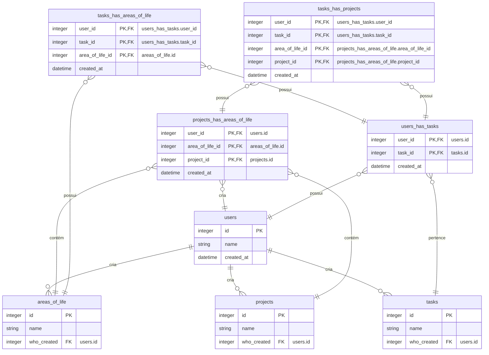

# Diagrama de Relacionamento das Entidades - ControleTempo

```mermaid
erDiagram
    users ||--o{ areas_of_life : "cria"
    users ||--o{ projects : "cria"
    users ||--o{ tasks : "cria"
    
    projects_has_areas_of_life }o--|| users : "cria"
    projects_has_areas_of_life }o--|| areas_of_life: "contém"
    projects_has_areas_of_life }o--|| projects : "contém"

    users_has_tasks }o--|| users: "possui"
    users_has_tasks }o--|| tasks: "pertence"

    tasks_has_areas_of_life }o--|| users_has_tasks : "possui"
    tasks_has_areas_of_life }o--|| areas_of_life : "possui"

    tasks_has_projects }o--|| users_has_tasks : "possui"
    tasks_has_projects }o--|| projects_has_areas_of_life : "possui"

    users {
        integer id PK
        string name
        datetime created_at
    }

    areas_of_life {
        integer id PK
        string name
        integer who_created FK "users.id"
    }

    projects {
        integer id PK
        string name
        integer who_created FK "users.id"
    }

    tasks {
        integer id PK
        string name
        integer who_created FK "users.id"
    }

    projects_has_areas_of_life {
        integer user_id PK,FK "users.id"
        integer area_of_life_id PK,FK "areas_of_life.id"
        integer project_id PK,FK "projects.id"
        datetime created_at
    }

    users_has_tasks {
        integer user_id PK,FK "users.id"
        integer task_id PK,FK "tasks.id"
        datetime created_at
    }

    tasks_has_areas_of_life {
        integer user_id PK,FK "users_has_tasks.user_id"
        integer task_id PK,FK "users_has_tasks.task_id"
        integer area_of_life_id PK,FK "areas_of_life.id"
        datetime created_at
    }

    tasks_has_projects {
        integer user_id PK,FK "users_has_tasks.user_id"
        integer task_id PK,FK "users_has_tasks.task_id" 
        integer area_of_life_id PK,FK "projects_has_areas_of_life.area_of_life_id"
        integer project_id PK,FK "projects_has_areas_of_life.project_id"
        datetime created_at
    }
```